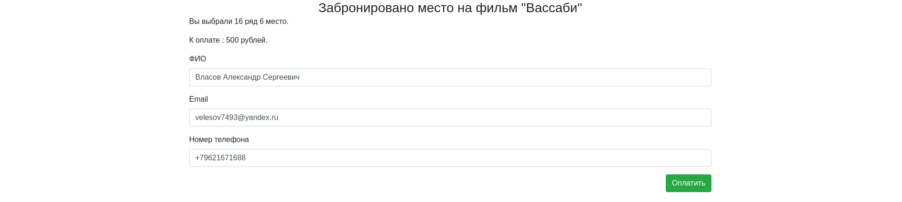

## Описание ##
Это учебный проект, иллюстрирующий процесс бронирования мест на фильм в кинотеатре.
Пользователь может забронировать себе место, выполнив 3 простых действия:
+ Выбрать фильм
+ Выбрать свободное место в зале
+ Ввести свои учетные данные на странице "Оплата"

Занятые места на странице кинозала обновляются ajax-запросом каждые 10 секунд, однако
все равно существует возможность выбрать место, которое уже занято. Если такое случается,
то пользователь получает сообщение об ошибке с предложением выбрать другое место.

#### В проекте используются технологии ####

## Скриншоты страниц ##
#### Выбор фильма ####

#### Выбор места в зале ####

Выбранное место в оранжевой рамке, а занятые - в фиолетовой.
#### Выбор места в зале с уже забронированными местами ####

#### "Оплата" ####

#### Если место уже забронировано ####
